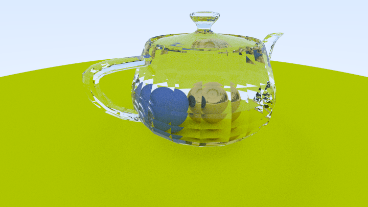

# Ray tracer
A small CPU ray-tracer, written in zig as a practice exersize.
The code is heavily inspired by 
[ray tracing in one weekend](https://raytracing.github.io/books/RayTracingInOneWeekend.html).



Outputs image to stdout in [ppm](https://en.wikipedia.org/wiki/Netpbm) binary format.
so run
```sh
zig build run > image.ppm
```

you can also run
```sh
zig build view
```

to build code, run the executable, capture its output to `zig-out` and open it. 
Although this expects that you have `xdg-open` in your system, and some image viewer is configured

The scene is hard-coded into `main` you can try and play with it
